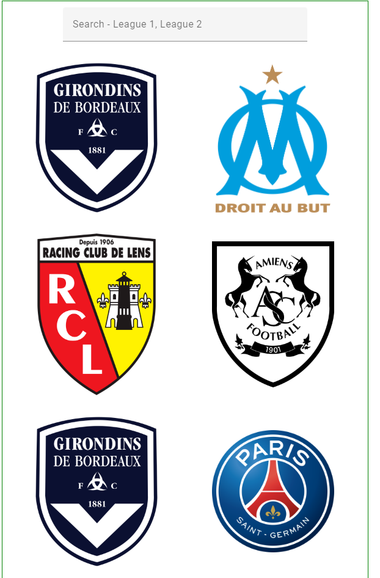
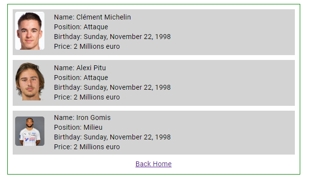

# FDJ Excercice Node/Angular/Mongo 
1. Le dossier API contient les services en node js
2. Le dossier Frontend: contient l'application en angular
3. Le dossier mongo DB: contient les collection mongo DB
## RESOURCES API REST FDJ
- /api/v1/leagues
- /api/v1/teams
- /api/v1/players`
## Routes
> Pour Leagues
- GET: /api/v1/leagues
- POST: /api/v1/leagues
- PUT: /api/v1/leagues/:id
- DELETE: /api/v1/leagues/:id
> Pour Teams
- GET: /api/v1/teams
- POST: /api/v1/teams
- PUT: /api/v1/teams/:id
- DELETE: /api/v1/teams/:id
> Pour Players
- GET: /api/v1/players
- POST: /api/v1/players
- PUT: /api/v1/players/:id
- DELETE: /api/v1/players/:id
## Screens Angular

